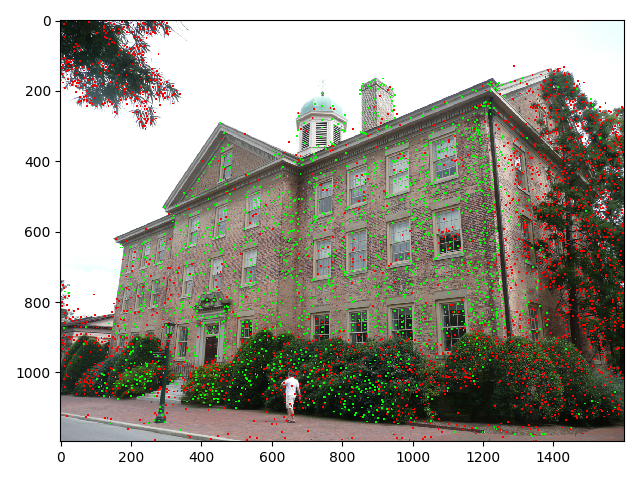
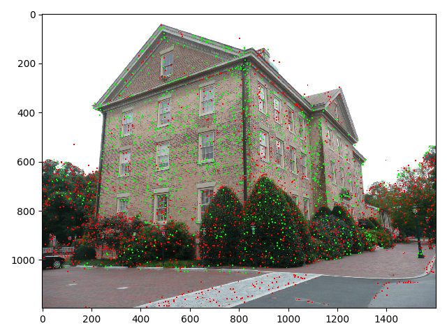
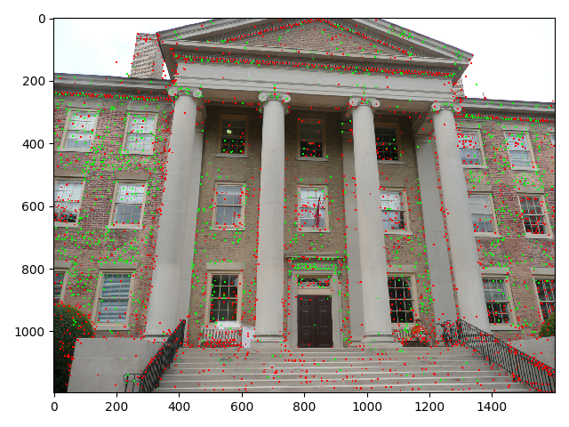
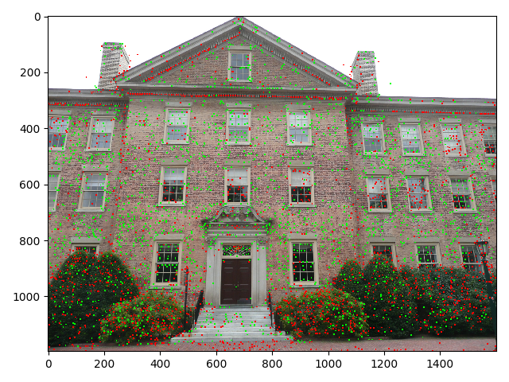
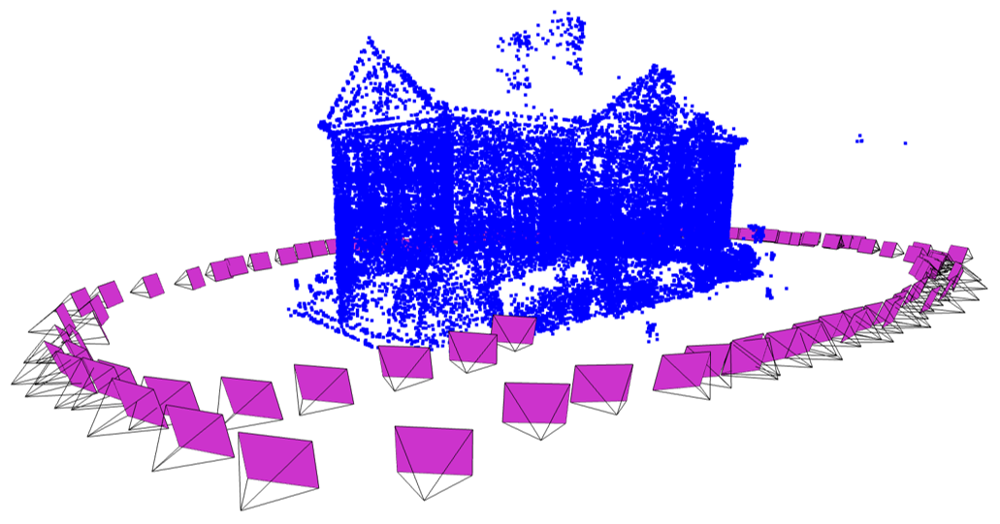
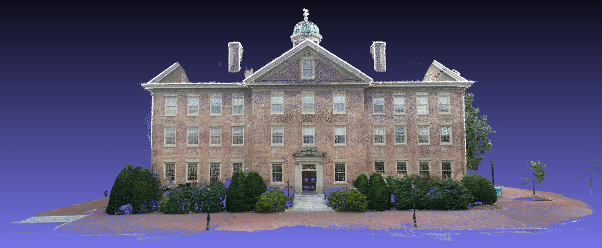

# Reconstruction through SfM and MVS given Unstructured RGB Images
Reconstruction from a set of unstructured RGB images traditionally first recovers a sparse representation of the scene and the camera poses of the input images using Structure-from-Motion (SfM). This output then serves as the input to Multi-View Stereo (MVS) to recover a dense representation of the scene.
## Spare Modeling (through Structure-from-Motion)
Structure-from-Motion (SfM) is the process of reconstructing 3D structure from its projections into a series of images. The input is a set of overlapping images of the same object, taken from different viewpoints. The output is a 3-D reconstruction of the object, and the reconstructed intrinsic and extrinsic camera parameters of all images. Typically, Structure-from-Motion systems divide this process into three stages:
* Feature detection and extraction
* Feature matching and geometric verification
* Structure and motion reconstruction

In the first step, feature detection and extraction finds sparse feature points in the image and describes their appearance using a numerical descriptor. In the second step, feature matching and geometric verification finds correspondences between the feature points in different images. For the feature points, if we are not able to find correspondences and determine 3D points, then we mark them with red color as are illustrated in the above two images.

In the third step, the incremental reconstruction process first loads all extracted data from the database into memory and seeds the reconstruction from an initial image pair. Then, the scene is incrementally extended by registering new images and triangulating new 3D points. Ideally, the reconstruction works fine for one model and all images are registered into the model. The above image illustrates the sparse representation of the scene and the camera poses of the input images.

## Dense Modeling (through Multi-View-Stereo)
After reconstructing a sparse representation of the scene and the camera poses of the input images, Multi-View-Stereo (MVS) can now recover dense scene geometry. The multi-view-stereo system divides this process into three stages:
* Image undistortion
* Depth (and normal) estimation
* Fusion

The first step is to undistort the images (for image undistortion, camera intrinsic parameters including focal length, distortion coefficients, etc. are already estimated in the SfM step). Given the undistorted images and undistorted cameras, the second step is to compute the depth (and normal) maps for all the registered and undistorted images using stereo. The third step is to fuse the depth (and normal) maps to a dense point cloud. Within the dense directory, the images folder contains the undistorted images, and the sparse folder contains the sparse reconstruction with undistorted cameras, the stereo folder contains the stereo reconstruction results. The fused point cloud (fused.ply) can be visualized with an external viewer such as Meshlab.

## References
* [Structure-from-Motion](https://demuc.de/papers/schoenberger2016sfm.pdf)
* [Multi-View-Stereo](https://demuc.de/papers/schoenberger2016mvs.pdf)
* [Large-scale Image-based 3D modeling](https://demuc.de/tutorials/cvpr2017/)